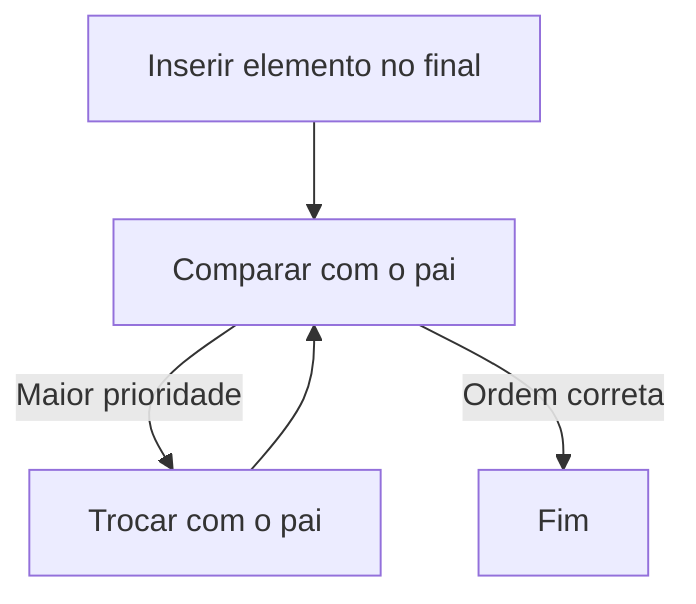
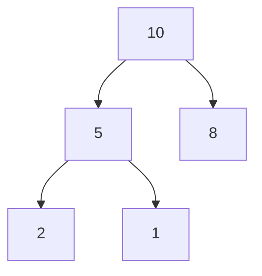
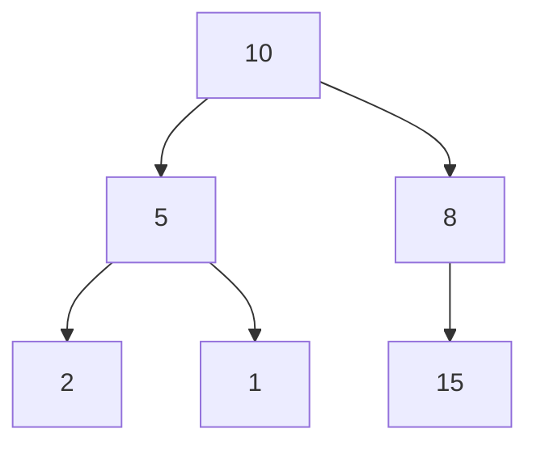
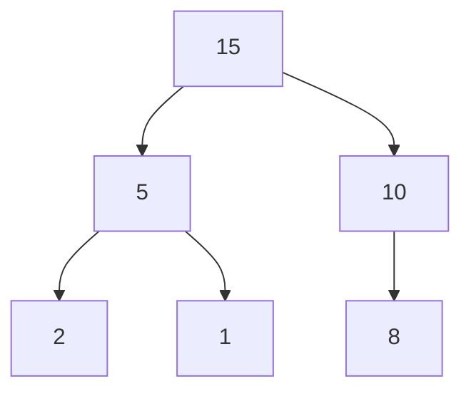
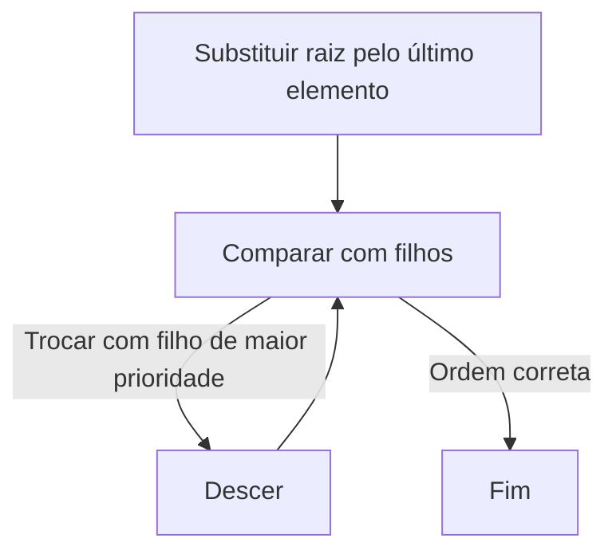
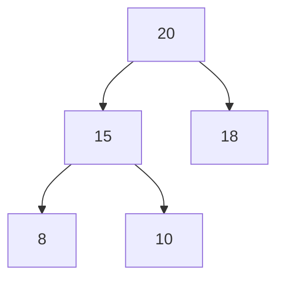
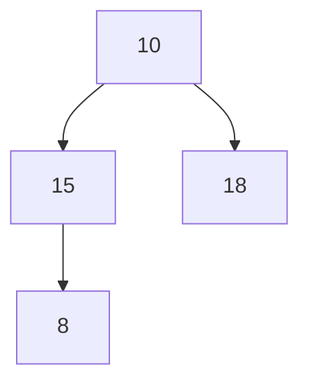
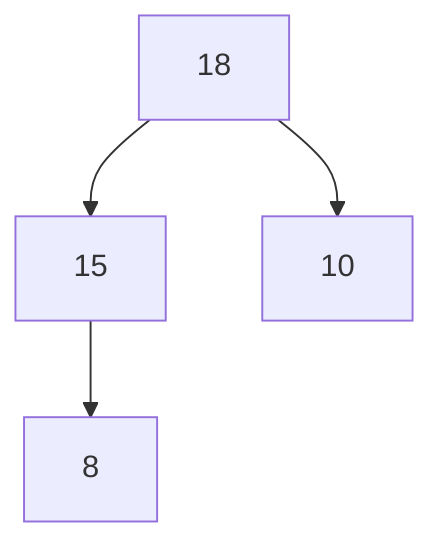

# Heaps Genéricos

Neste laboratório, vamos estudar e implementar a estrutura de dados **Heap** (fila de prioridade), utilizando um **Vector genérico já implementado** como estrutura subjacente.

O heap mantém uma **propriedade de ordem parcial**: para toda subárvore, o elemento com maior prioridade (definida por uma função de comparação) deve estar sempre na raiz.

Um heap binário é uma árvore binária completa armazenada implicitamente em um array (no nosso caso, um `Vector`).

Para um índice `i`, podemos calcular os índices do pai e dos filhos usando as expressões abaixo:

* Filho esquerdo: `2*i + 1`
* Filho direito: `2*i + 2`
* Pai: `(i - 1) / 2` (parte inteira)

---

## Visão Geral

Estrutura do Projeto:

```
codigo/
    - heap.h
    - heap.c
    - main.c
    - Makefile
```

No arquivo `heap.h`:


```c
#ifndef _HEAP_H_
#define _HEAP_H_

// Função de comparação. Deve retornar valor > 0 se primeiro elemento tem maior prioridade e valor < 0 se o segundo em mais prioridade.
typedef int (*cmp_fn)(void* a, void* b);

typedef struct Heap Heap;

// Cria um heap vazio
Heap *heap_construct(cmp_fn cmp);

// Libera memória do heap
void heap_destroy(Heap *h);

// Insere um elemento no heap
void heap_push(Heap *h, data_type value);

// Remove e retorna o elemento de maior prioridade
data_type heap_pop(Heap *h);

// Retorna o número de elementos
int heap_size(Heap *h);

// Verifica se está vazio
int heap_empty(Heap *h);

#endif
```

---

No arquivo `heap.c`, temos a estrutura do heap e as implementações das funções:

```c
#include "heap.h"

struct Heap
{
    Vector *data;
    cmp_fn cmp;
};

// implementações das funções

```

---

---

## Inserção (heap_push)

A ideia geral da função é:

1. Inserir o elemento no final do vector
2. Restaurar a propriedade do heap subindo o elemento (**heapify-up**)


**Passo a Passo**:




* Inserir na última posição
* Comparar com o pai
* Se tiver maior prioridade: trocar
* Repetir até:
  * chegar na raiz, ou
  * a propriedade do heap ser satisfeita

---

Por exemplo, considere o heap abaixo:



Após inserir o valor `15` ao final:



Após heapify-up:



---

## Remoção (heap_pop)

A idéia geral do algoritmo é:

1. Remover a raiz (elemento de maior prioridade)
2. Substituir pela última folha
3. Restaurar a propriedade do heap descendo o elemento (**heapify-down**)

**Passo a Passo**:



* Salvar o valor da raiz
* Remover último elemento do vector movê-lo para a raiz
* Repetir até não violar a propriedade do heap:
  * Comparar com os filhos e trocar com o filho de maior prioridade

Por exemplo, considere o heap abaixo:



Depois de remover o elemento do topo e colocar o último elemento no lugar, chegamos na configuração abaixo. Note que a propriedade do heap deixou de ser cumprida.



Após utilizar a operação de heapify-down para corrigir o heap:



---

## Funções auxiliares

Embora não sejam expostas na interface, é útil pensar nas seguintes funções auxiliares:

* **_heapify_up(index)**: Responsável por restaurar a propriedade após inserção.
* **_heapify_down(index)**: Responsável por restaurar após remoção.

---

## Complexidade das Operações

| Operação   | Complexidade     |
| ---------- | ---------------- |
| Inserção   | O(log n)         |
| Remoção    | O(log n)         |
| Topo       | O(1)             |
| Construção | O(n) (otimizado) |

